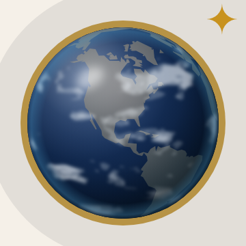
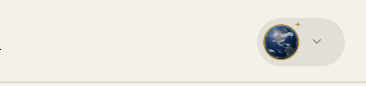
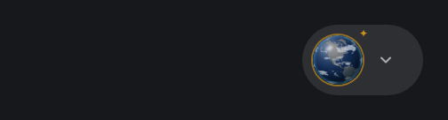

# Handoff: globe member badge → Questura

Replace the "Q" in the navbar's member badge with a small globe in the colours
of the join page's hero globe, so a new member sees the same Earth in their
badge that they saw when they joined.

| Zoomed in | Light nav (Atlantic 100) | Dark nav (Atlantic 150) |
| --- | --- | --- |
|  |  |  |

## Who sees it

Exactly who saw the Q: signed-in **members** (`isMember` on `UserIcon`, from
`useMembership`). Signed-in non-members keep the plain person icon; signed-out
readers keep "Sign in". Nothing about who qualifies changes.

## Files in this folder

| File | Goes to (in `Questurian/questura`) |
| --- | --- |
| `GlobeMark.tsx` | **new**: `apps/questura/apps/client/src/features/Navigation/shared/components/icons/GlobeMark.tsx` |
| `UserIcon.tsx` | **replaces** `apps/questura/apps/client/src/features/Navigation/shared/components/icons/UserIcon.tsx` |
| `UserIcon.diff` | the same change as a patch, for when `UserIcon.tsx` has moved on |
| `preview-*.png` | screenshots only; not shipped |

`UserIcon.tsx` here is Questura's own file as of `main` @ `72a0668` with only
the member branch changed (diff below), so the `--nav-*` tokens, `"use client"`
and the `@/lib/stores/userModalStore` import are the real ones, not the lab's.

No images, fonts or packages ship: `GlobeMark` is one self-contained SVG
component (~13 KB of source, mostly path data).

## Steps (in `~/Desktop/questura`)

1. Branch from an up-to-date `main`:

   ```bash
   git switch main && git pull
   git switch -c feat/globe-member-badge
   ```

2. Copy the component in. From the repo root:

   ```bash
   ICONS=apps/questura/apps/client/src/features/Navigation/shared/components/icons
   ```

   then from a local checkout of the lab (on the branch
   `claude/tender-faraday-f06f06`, or `main` once it's merged there):

   ```bash
   LAB=~/path/to/questura-navbar-lab/handoffs/globe-member-badge
   cp "$LAB/GlobeMark.tsx" "$ICONS/GlobeMark.tsx"
   ```

   Or straight from GitHub, no lab checkout needed:

   ```bash
   REF=claude/tender-faraday-f06f06
   gh api "repos/alanmalpartida/questura-navbar-lab/contents/handoffs/globe-member-badge/GlobeMark.tsx?ref=$REF" \
     -H "Accept: application/vnd.github.raw" > "$ICONS/GlobeMark.tsx"
   gh api "repos/alanmalpartida/questura-navbar-lab/contents/handoffs/globe-member-badge/UserIcon.diff?ref=$REF" \
     -H "Accept: application/vnd.github.raw" > /tmp/UserIcon.diff
   ```

3. Apply the `UserIcon` change. If `git log 72a0668..main -- "$ICONS/UserIcon.tsx"`
   prints nothing, the file hasn't changed and you can copy `UserIcon.tsx` over.
   Otherwise apply the patch (from the repo root):

   ```bash
   git apply "$LAB/UserIcon.diff"      # or /tmp/UserIcon.diff
   ```

   The whole change is: import `GlobeMark`, and in the `isMember` branch drop
   the navy gradient and the `Q` span for a dark backing plus the globe. The
   gold ring (`boxShadow`) and the gold `✦` stay as they are. Abridged below;
   `UserIcon.diff` is the exact patch.

   ```diff
   +import GlobeMark from "./GlobeMark";
   ...
            <span
   -            className="relative flex h-[22px] w-[22px] shrink-0 items-center justify-center rounded-full 480:h-[28px] 480:w-[28px]"
   -            style={{
   -              background: 'linear-gradient(160deg, #1e3599 0%, #05092e 100%)',
   -              boxShadow: '0 0 0 1px rgba(172,128,32,0.8)',
   -            }}
   +            className="relative flex h-[22px] w-[22px] shrink-0 rounded-full 480:h-[28px] 480:w-[28px]"
   +            // Dark behind the globe so its anti-aliased edge never shows a light hairline.
   +            style={{ background: '#04101E', boxShadow: '0 0 0 1px rgba(172,128,32,0.8)' }}
              >
   -            <span className="font-display text-[8px] font-semibold text-white/90 480:text-[10px]" style={{ lineHeight: 1 }}>
   -              Q
   -            </span>
   +            <GlobeMark className="block h-full w-full" />
   ```

4. Optional tidy-up: `apps/questura/apps/client/src/features/Navigation/navThemeTokens.test.mjs`
   lines 46-47 say the member badge is exempt because of its white "Q". The
   exemption still applies (the badge is its own disc, the same on both bars);
   reword the comment to say "globe" instead of "Q". The regex under it needs
   no change.

5. Check it (from `apps/questura/apps/client`):

   ```bash
   pnpm test && pnpm typecheck && pnpm lint
   ```

   Then look at it signed in as a member, on the **local** API (see
   `AGENTS.md`: live's CORS refuses localhost, so the navbar reads signed out
   against live):

   ```bash
   pnpm --dir apps/questura/apps/server dev:member <your-email> member
   cd apps/questura && pnpm dev          # http://localhost:3000
   ```

   Check the badge on the light and the dark navbar, at desktop width and
   below 480px (it's 22px there, 28px above). Then `dev:member <email> none`
   and confirm a non-member still gets the plain person icon.

6. Open a PR. **Don't merge until it's been looked at on localhost**: merging
   to `main` deploys to www.questurian.com.

## Why it's built the way it is

- **`"use client"`** because `GlobeMark` calls `useId`. `useId` is also what
  keeps it hydration-safe: the server and client agree on the ids.
- **Per-instance gradient ids.** The navbar renders the desktop and mobile
  bars at once and hides one with CSS. With fixed ids, both copies' `url(#…)`
  would resolve to the first match in the document, which can be the hidden
  copy, and the visible globe would render black.
- **Hard-coded colours, on purpose.** Like the old navy Q disc, the badge is
  identical on the light and dark bars, so it doesn't use `--nav-*` tokens.
  The palette test exempts the `isMember` block and only scans class names;
  with this change applied at `72a0668`, all 8 tests in
  `src/features/Navigation/*.test.mjs` pass.
- **Same size as before** (22px / 28px at 480+), so `AuthSlot`'s reserved
  width and `authSlotReservesItsWidth.test.mjs` are unaffected. The e2e
  fixtures find the button by its `Open user menu` label, which is unchanged.
- **Colours** come from the join hero as it renders
  (`features/Payments/components/JoinHeroVisual.tsx` and
  `app/styles/global/membership.css`: the photo darkened with
  `saturate(.76) brightness(.7)` over `#031522`-`#041a29`, with a teal glow),
  sampled from the rendered page and lifted slightly on the lit side so the
  globe reads at 22px: navy ocean `#2F4D7E` → `#04101E`, slate land
  `#7A7B7F` → `#1C2A32`, faint grey-white cloud, a white sheen top-left, a soft
  `#4FA3D6` atmosphere at the rim. The view is North America, as on the join
  page.
- **Geography** is Natural Earth 1:110m (the `world-atlas` package) projected
  with `d3-geo`; the clouds are traced with `d3-contour` from procedural
  weather noise. None of that is a Questura dependency: it runs in the lab
  and the output is static SVG.

## Changing it later

The globe is generated. In the lab, edit `scripts/render-globe-mark.mjs` and
run `pnpm render-globe-mark`: it rewrites the lab's Atlantic 100 / 150 copies
and `handoffs/globe-member-badge/GlobeMark.tsx`. Copy that file over again;
don't hand-edit the path data.

## Rolling back

Revert the commit. The Q badge comes back exactly as it was; nothing else
depends on `GlobeMark`.
